# App-Ecommerce-Symfony-6-Showcase

## Welcome! 👋

Thanks for checking out this personal project, more screenshots available down below ⬇️.

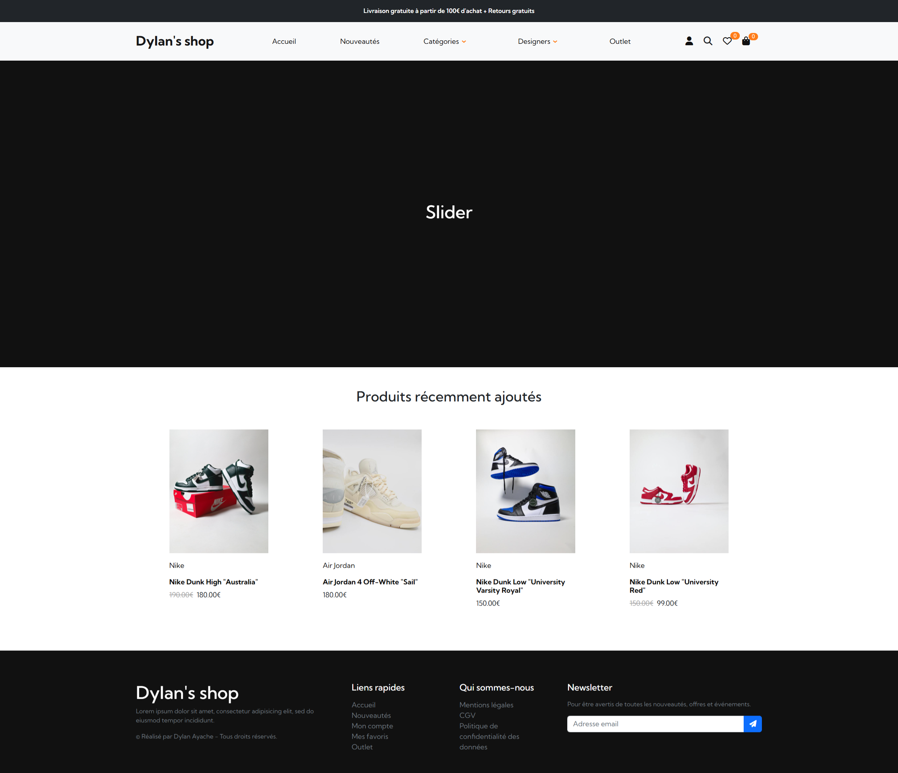
## The Project

E-commerce developped with Symfony 6, with a MVC architecture with keys functionalities for an online shop. 
This repository is a showcase : it serves to present the functionalities and the project's pictures.
Feel free to ask me if a direct access to the main repository which is currently private for security reasons. 

**The functionalities are :**
- A page dynamically displaying a list of products according to their categories, designers, a page for new arrivals and for the outlets. There is a pagination system incorporated with KnpPaginator

- A page dynamically displaying product details, where the user can add the product to their cart by selecting a valid size and quantity. There is also a button to add the product to favorites, with an AJAX request for UX design purposes

- User authentication and registration, using a regex for password following OWASP guidelines, and a honeypot to prevent automated bot spam attacks as well as a mail is sent to the user to confirm his account

- Access to various user account pages for order tracking, modifying personal information, or managing addresses

- A cart system is implemented, allowing users to add, delete, or manage quantities of products before validating their order, all the intereactions are made with AJAX requests for UX design purposes

- A checkout system is implemented, allowing the user to choose existing shipping and billing adress or to create one, to choose a payment type, a preview of the products before confirming the purchase

- Once the order is confirmed, a success page is displaying as well as an order confirmation is sent by mail

- A favorite system is also implemented, allowing users to add products for later purchase

- Several vulnerabilities are addressed, including SQL, CSRF, and XSS. There are also verifications that redirect to a 404 page if a user is not authorized to perform a certain action or access certain content

- Search bar which allows to search by designer, category, product name + a combination of two of keywords

- There is an administration dashboard which allows to the owner of the website to manage as he wishes the products, users, stock, sizes, variants availables etc..

- The project is fully responsive

**The future functionalities are :**
- Stripe payment system
- TypeScript implementation to secure the JavaScript

**Stacks used :**
- PHP 8
- Twig
- CSS
- Sass
- HTML
- JavaScript / AJAX / jQuery

**Framework :**
- Symfony 6
- Bootstrap 5

**Bundles :** 
- KnpPaginator
- VerifyEmailBundle
- EasyAdminBundle 4
- ResetPassword
 
**Don't hesitate to contact me for further informations or to check the code to see more about this app!** 🚀

## Screenshots of this project

### Products
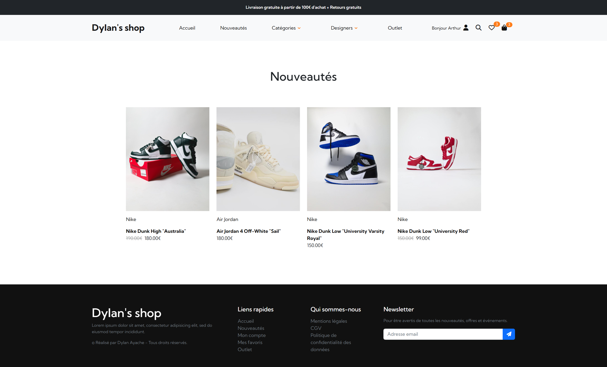
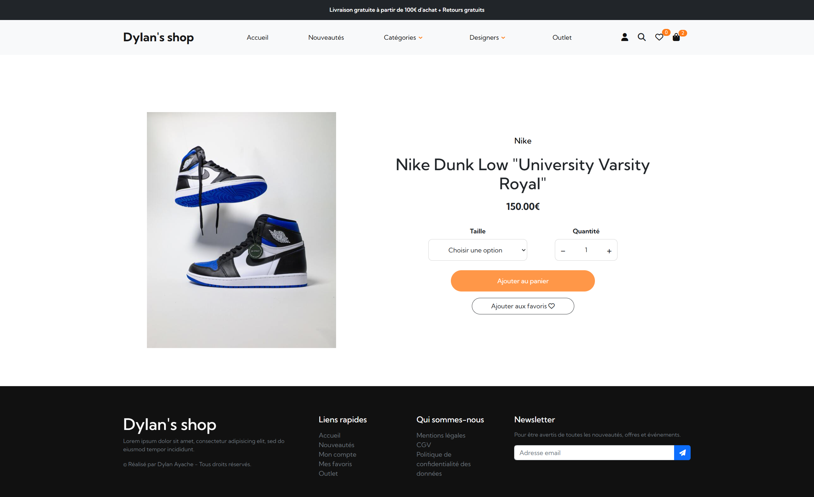
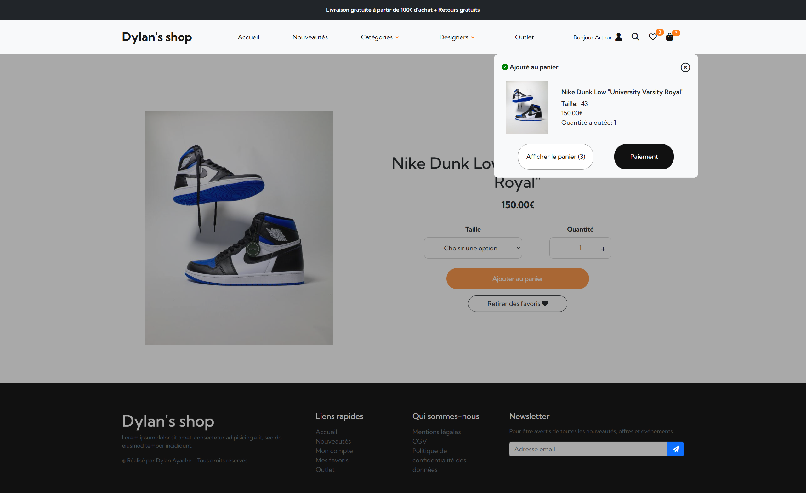

### Favorites, Cart and Checkout
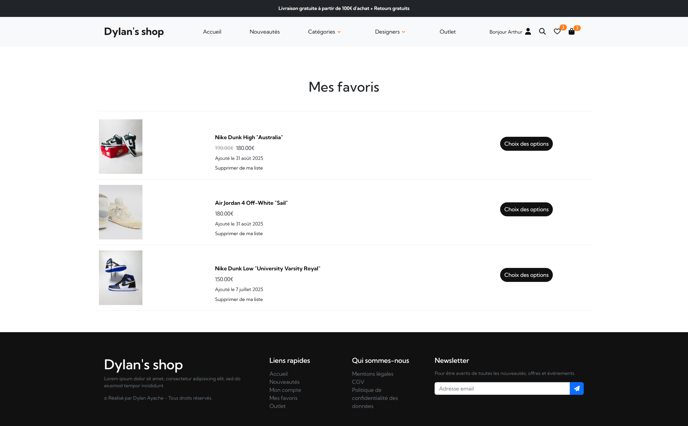
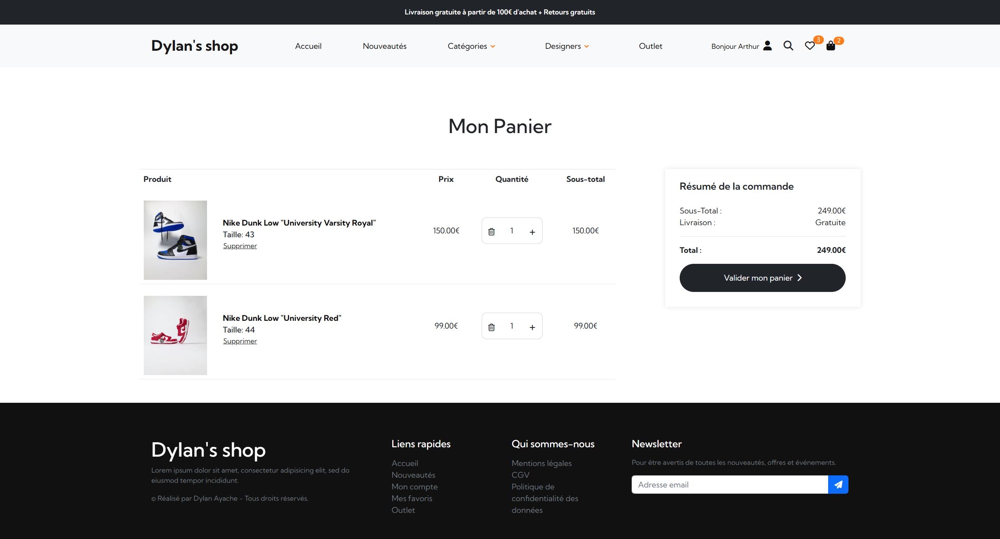
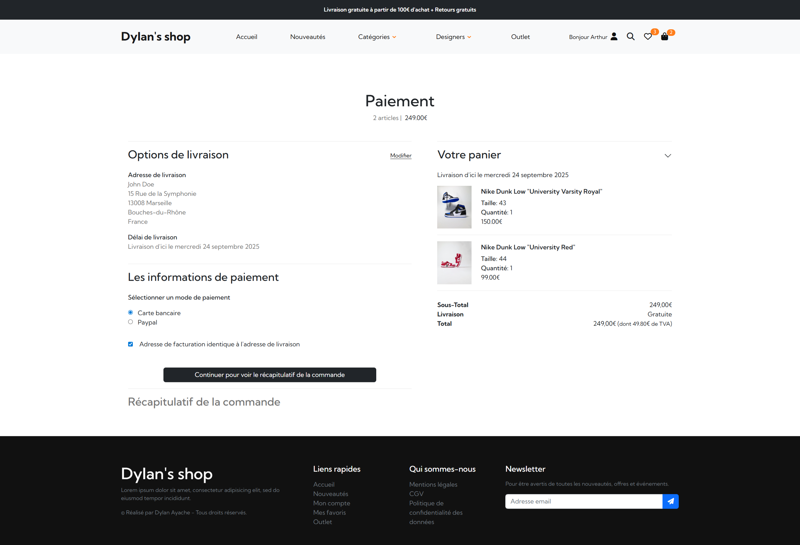
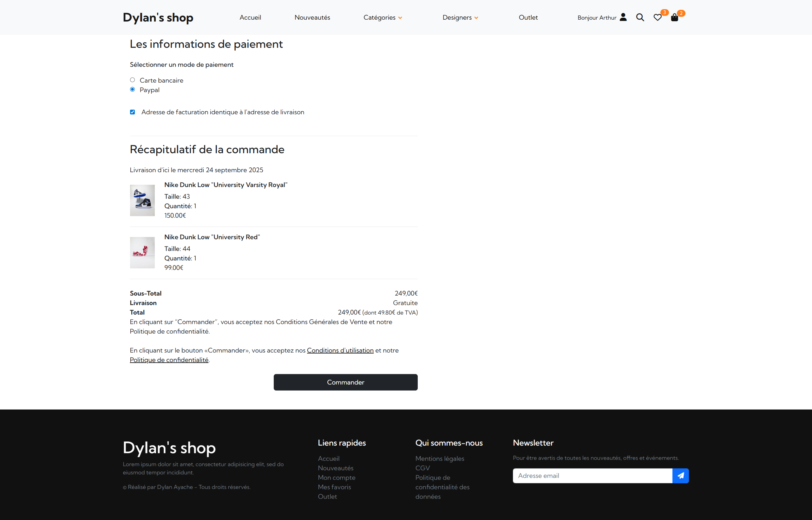

### Account
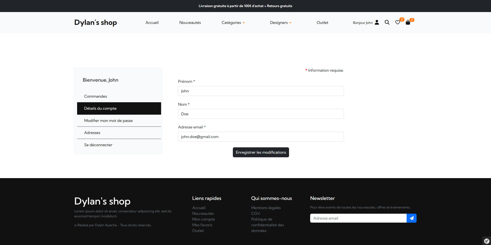
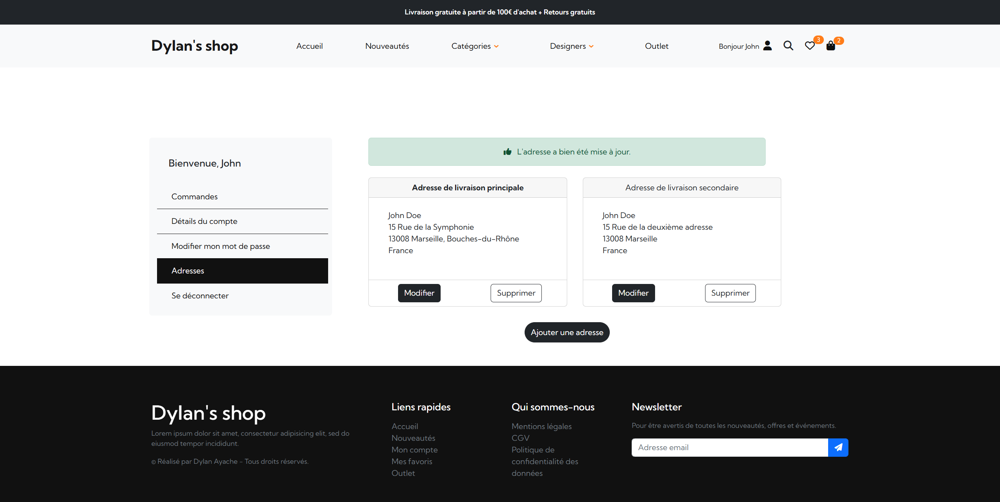
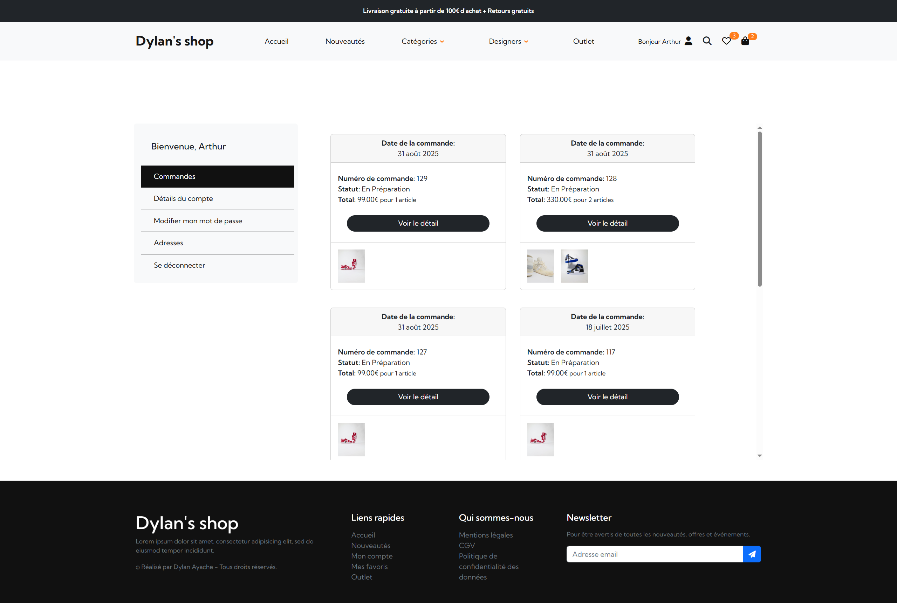

### Back-office
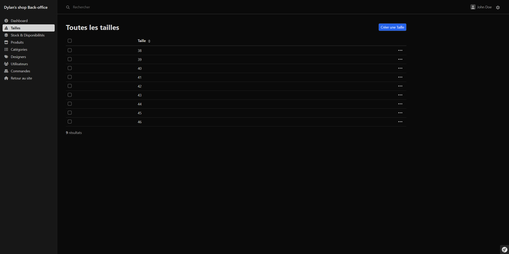
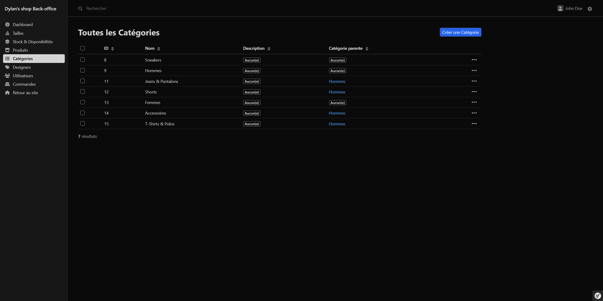
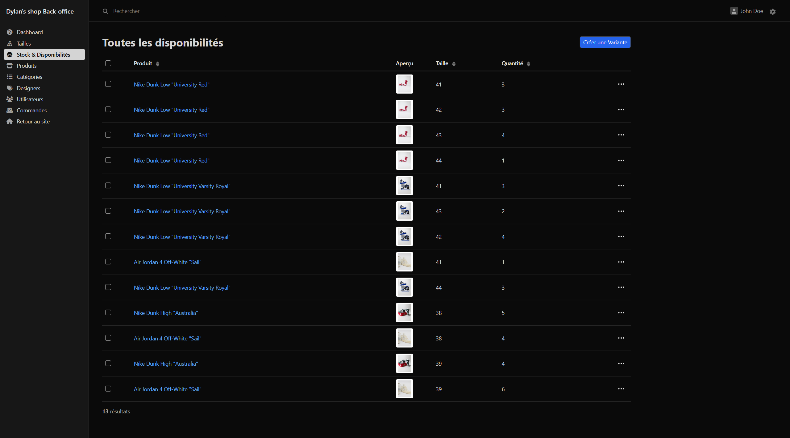
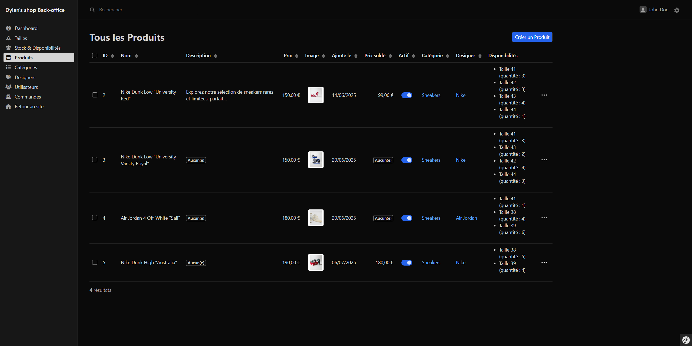
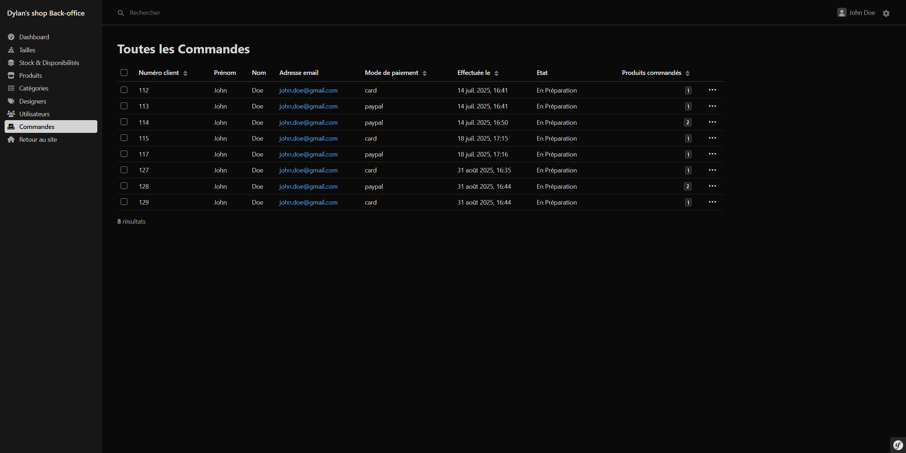
